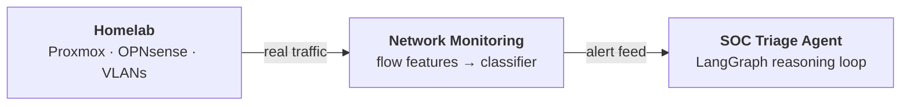

---

I've been taking things apart since I was a kid. I fried the motherboard of my first PC at 10, rebuilt it out of necessity, and that loop — break → understand → rebuild — never really stopped.

These days it shows up as a refusal to rent the layer below the one I need. I wanted to see what a network actually does, so I built one — OPNsense at the edge, VLANs carved properly, Proxmox underneath, an isolated segment where malware gets detonated without touching anything that matters. A small enterprise in a spare room, and everything below ships inside it.

What that really gave me is a small enterprise I control end to end. Traffic that's actually mine, flow-feature classifiers on top of it, an agent reasoning through whatever they flag — and then the part most projects skip: putting it back into production. Model registry, containers, CI, a service with uptime, on hardware I'm responsible for when it falls over. Every layer is mine to get wrong.

Then it turned outward. Small businesses rarely have a data problem a dashboard can fix — they have no data at all, and the thing they need isn't for sale. So I build the whole stack: the capture that creates the record, the schema that holds it, the models that read it, and the surfaces the people running the place actually touch. Built to grow with them rather than get replaced. Every layer I've picked up so far, pointed at a problem someone actually has — and it's the part I like most.

On the way: I taught an AI to land a rocket, built a model that finds pool-cleaning leads from satellite imagery, another that catches people peeking at your screen, rebuilt Shazam from scratch, and mapped where a fruit grows that nobody can farm. My own LLM is in training. Among other things.

Half my life in the US, half in Europe. I still take the long route first — it's what makes the shortcuts obvious.

                                                           

---

<b>01 · THE INFRASTRUCTURE</b> &nbsp;·&nbsp; The metal the rest of it runs on.

 

Three repos that form one system. Each was built because the one below it made it possible.

**[Homelab](https://github.com/BOYSABIO/homelab)**   Firewall, network segmentation, hypervisor, isolated malware-testing environments. The point was never the tools — it was owning the infrastructure so everything above it runs on something real. It doubles as a deployment target: the models below are hosted here.

**[Network Monitoring](https://github.com/BOYSABIO/Network-Monitoring)**  
PCAP capture → flow feature extraction → ML/DL classification → clean ndjson. Benign/malicious classification at ~95% accuracy and 0.992 ROC-AUC from flow features alone, plus multi-class attack detection. Runs against the homelab; its output is the next layer's input.

**[SOC Triage Agent](https://github.com/BOYSABIO/SOC-Triage-Agent)**  
Gates incoming alerts, builds case briefs, then runs an LLM reasoning loop with tools — flow lookups, IP reputation — to produce structured triage decisions. The interesting problem isn't security, it's agent architecture: when to gate, what context to fetch, how to make a model's output land as a decision rather than a paragraph.

<b>02 · THE MODELS</b> &nbsp;·&nbsp; Trained on real data, then deployed as services.

 

**LLM-Lab**    My own implementation of the pipeline the frontier labs run: data curation → pre-training → SFT → DPO → evals → inference optimization. Two tracks — a proxy ladder (1M → 100M params) for cheap ablations, and a main model trained only on directions the proxies validate. Using models through an API stops being enough once you want to know *why* they work.

**[Huckleberry Habitat Model](https://github.com/BOYSABIO/Huckleberry-Habitat-Suitability-Model)**  
The brief was *"monetize Microsoft GridMET climate data."* I delivered a feasibility study predicting huckleberry habitat suitability — ~450GB of environmental data, >90% accuracy, interactive maps, confidence outputs. Then I extended it into live infrastructure: FastAPI `/predict` with per-tree confidence intervals, an MLflow registry the API loads by URI, a Dockerized stack, GitHub Actions CI, deployed to a container on the homelab. The capstone is a service you can call.

**[Modular MLOps Pipeline](https://github.com/BOYSABIO/MLOps)**   A simple CNN refactored into a production-style system: modular pipeline steps, Hydra config management, dual experiment tracking, containerized FastAPI serving, pytest and GitHub Actions CI. This was my introduction into truly bringing a project into production.

<b>03 · THE PRODUCTS</b> &nbsp;·&nbsp; Software with users who aren't me.

 

**[MuttMetrics](https://github.com/BOYSABIO/muttmetrics)**   
I run the technical side of a dog grooming salon — the site, the database, the backend, the interfaces the people there use, and the analytics on top. MuttMetrics is the layer underneath: owner and dog records, breed and service priors, and a model of how long the work really takes by breed, coat condition and service. On top of that sits the business view — where the day overruns, what an hour is actually worth by job type, what to charge, and how much the shop can take on. A groom that runs an hour long isn't a scheduling problem, it's a margin problem, and until it's measured nobody knows which jobs are paying for themselves.

**Language Learning Platform**    
A full product, built end to end and deployed: vocabulary tracking with morphology awareness, a document editor with click-to-translate, teacher–student collaboration, practice tools, analytics. Piloted with real tutors and students, now iterating on what they actually did with it. Private because it's a product rather than a portfolio piece — which is the point. Scoped it, built it, shipped it, put it in front of users, and learned the roadmap from them instead of guessing it.

**ExamGuard**   
A modular proctoring layer running alongside Safe Exam Browser. Client-side webcam inference — phone detection via YOLOv8, gaze estimation via MediaPipe, multi-person detection — producing timestamped flags with confidence scores. It never removes a student; it only flags. Ring-buffer clip upload keeps bandwidth sane, professors review and label in a dashboard, and those labels feed a fine-tuning loop. Built with a teammate. The repo is private deliberately: students must not be able to study how to defeat it.

---

<b>Archives</b> &nbsp;·&nbsp; every other project, by domain

 

**Products**

- **[MuttMetrics](https://github.com/BOYSABIO/muttmetrics)** — the data and prediction layer for a working dog grooming salon; capture-first design, Postgres + FastAPI
- **Language Learning Platform** 🔒 — AI-assisted platform for tutors and students; Next.js, Prisma, Neon, Vercel
- **ExamGuard** 🔒 — proctoring layer for Safe Exam Browser; YOLOv8 + MediaPipe, human-in-the-loop review, fine-tuning flywheel
- **[Discord Music Bot](https://github.com/BOYSABIO/discord-music-bot)** — self-hosted; Lavalink v4, Riffy, Docker Compose, deployed to its own homelab container

**Machine Learning & AI**

- **LLM-Lab** 🔒 — full model pipeline from scratch: curation, pre-training, SFT, DPO, evals, inference optimization
- **[Huckleberry Habitat Suitability Model](https://github.com/BOYSABIO/Huckleberry-Habitat-Suitability-Model)** — Microsoft capstone, ~450GB GridMET data, honors; extended into a deployed FastAPI service with MLflow registry, Docker, CI, homelab hosting
- **[Predicting Hotel Cancellations](https://github.com/BOYSABIO/Hotel-Cancellations-Prediction-Model)** — ensemble ML with feature engineering and optimization
- **[CO₂ Emissions Forecast](https://github.com/BOYSABIO/CO2-Emission-Forecast-Model)** — time-series forecasting of global flight emissions

**Systems & Security**

- **[Homelab](https://github.com/BOYSABIO/homelab)** — OPNsense, VLANs, Proxmox, IDS/IPS, isolated malware testing. Foundation and deployment target for everything above.
- **[Network Monitoring & Traffic Analysis](https://github.com/BOYSABIO/Network-Monitoring)** — PCAP → flow features → ML/DL classifier → ndjson; feeds the triage agent
- **[SOC Triage Agent](https://github.com/BOYSABIO/SOC-Triage-Agent)** — LangGraph agent: alert gating, case briefs, tool-calling reasoning loop, structured verdicts

**MLOps & Data Engineering**

- **[MNIST MLOps Pipeline](https://github.com/BOYSABIO/MLOps)** — modular pipeline steps, Hydra config, MLflow + W&B, containerized FastAPI serving, pytest + CI
- **[Audio Fingerprinting & Matching](https://github.com/BOYSABIO/Audio-Fingerprinting-Matching-Pipeline)** — Shazam-inspired at scale: Bronze → Silver → Gold lakehouse on Databricks, PySpark fingerprint hashing, confidence-scored matching

**Computer Vision**

- **[Pool Detection CNN](https://github.com/BOYSABIO/Pool-Detection-CNN)** — YOLO on satellite imagery, with oriented bounding boxes that rotate to fit pools of any shape
- **[Screen Snooper Detection](https://github.com/BOYSABIO/Screen-Snooper-Detection)** — real-time detection of someone reading your screen; YOLOv8 + MediaPipe gaze, custom dataset labeled with Grounding DINO, primary-user exclusion
- **[Image to ASCII](https://github.com/BOYSABIO/Image-to-Ascii)** — image → ASCII art converter, built because the manual process annoyed me

**Quantitative Finance**

- **[Stock Analysis & Prediction Dashboard](https://github.com/BOYSABIO/Stock-Analysis-Prediction-Dashboard)** — real-time analysis and prediction (Streamlit)
- **[Asset Price Path Simulator](https://github.com/BOYSABIO/Asset-Price-Path-Sim)** — Bachelier and Samuelson models
- **[ARCH/GARCH Volatility Modeling](https://github.com/BOYSABIO/OM-group-project-2)** — volatility models on CrowdStrike data

**Reinforcement Learning**

- **[Lunar Lander & Car Racing](https://github.com/BOYSABIO/DQN-DDQN-Gymnasium)** — DQN and DDQN agents on Gymnasium control tasks

🔒 = private repository. Happy to walk through any of these in a conversation.

<b>Notes</b> &nbsp;·&nbsp; coursework and study notes, in public

 

- **[MSc Data Science — IE University](https://github.com/BOYSABIO/IE-University)** — coursework and academic projects
- **[CompTIA Security+ Notes](https://github.com/BOYSABIO/CompTIA-SecurityPlus-Notes)** — *in progress*

---

**Conviction comes from contact. Everything here is something I got into before I was ready.**

